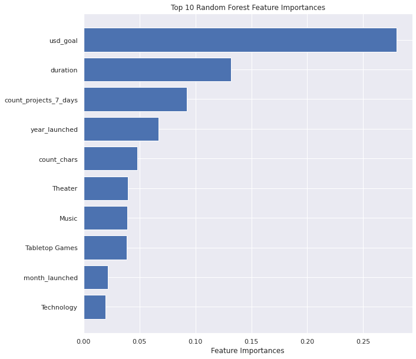
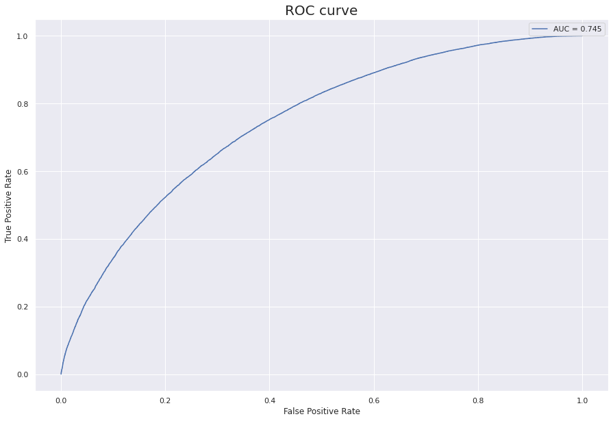

# kickstarter_project_prediction
Using a dataset from <a href="https://www.kaggle.com/datasets/kemical/kickstarter-projects" target="_blank">Kickstarter</a>, the goal of this project is to be able to predict if a project will get sufficient funding from the backer's before deadline.

## Results:
Here's a look at the main parameters that can impact the state of your campaign on Kickstarter:

XGBoost Classifier model ROC curve:

